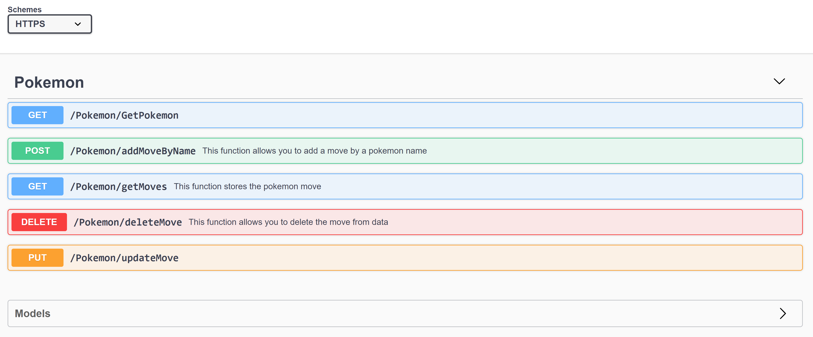

# MSA-back-end-Submission-pokemon-API
submission for back-end with pokemon API

Endpoints of the swagger

This is a pokemon api that calls the poke.api to retrieve the moves of the pokemons. 
It is very simple and all that is required is to type in a pokemon's name and 
it will return their ability/move. 

**STEPS**
1. press run button after opening VS
2. [POST] type in a pokemon's name to add a move to the data (move will be shown)
3. [GET] type in the move that appeared in previous function.
4. [DELETE] you can choose to delete the move from the data (optional)
5. [PUT] update the move with another one if you wish

**MSA Requirements:**
1. pokemon controler has all the CRUD with (GET, POST, DELETE and PUT) them being in order [DONE]
2. calls another api [DONE]
3. created two configuration files which enforces privacy of info. The difference between the 
two is that appsetting.Development.json contains the name of the database and external address of the API
4. The middleware through Dependency Injection, has the opportunity to inject 
services needed for the next middleware. It is useful and simplifies code by allowing the interface
to be used. It reduces dependencies and presents benefits such as better code as it is reusable 
and has better readability [DONE]
5. Used NSubstitute to connect to repo to test it [DONE]
6. Demonstrated the use of NUnit [DONE]
7. middleware is flexible and allows the user to save time without having to create a custom integration 
every time we need to connect to application components [DONE]
